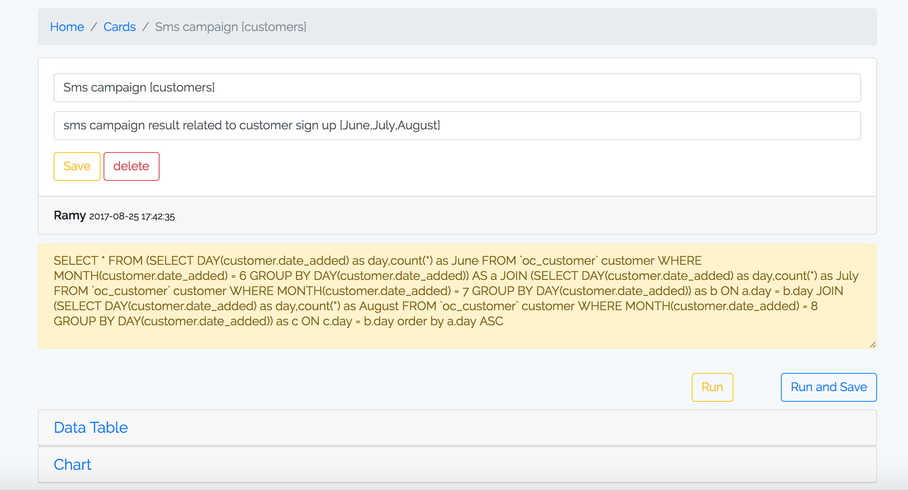

# SQL Report View/Export
Build with Laravel 5.4, Vue.js, Bootstrap 4 (Beta), DataTable.



### Why

- I am getting started with Vue.js, webpack.
- Mixing Vue.js, Bootstrap 4, DataTable is not an easy task for js beginners.
- My boss always ask for Reports :)

### How to use

- Edit .env with ``DB_DATABASE`` for project(user management) and ``DB_DATABASE_REPORTS`` (which will run sql queries over).
- Run ```artisan migrate```.
- Open /register and create new account.
- Install npm package manager.
- Run ```npm run dev```.

### Features

- Add/Edit/Delete SQL cards.
- Show DataTable result (sort, search, export).
- Show Bar Chart.
